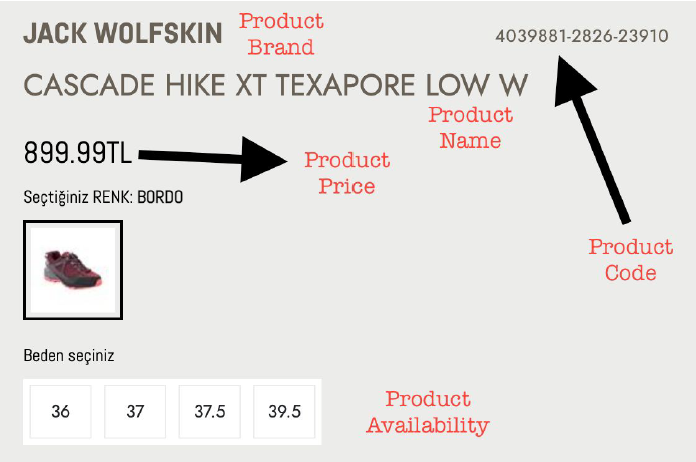

# Web Scraping Analyticahouse Case
Lets say one of our customers demanded a Product Report which consisting of product code, product name, product brand, product availability( as a percent ) , product price for all of products they have. 

Your mission is build a crawling system which will go to those URLs (There is an xlsx file at the attachment), scrape necessary metrics and write to Excel as seperate columns. At the below picture all metrics can be seen. 

Note: You should append www.spx.com.tr to every path for reaching page.

Bir müşterimizin ürün kodu, ürün adı, ürün markası, ürün bulunabilirliği (yüzde olarak), sahip oldukları tüm ürünler için ürün fiyatını içeren bir Ürün Raporu talep ettiğini varsayalım. 

Göreviniz, bu URL'lere gidecek (ekte bir xlsx dosyası var), gerekli ölçütleri kazıyacak ve ayrı sütunlar halinde Excel'e yazacak bir tarama sistemi oluşturmaktır. Aşağıdaki resimde tüm ölçüler görülebilir. 

Not: Her sayfaya ulaşmak için www.spx.com.tr 'yi eklemelisiniz.

## [Data Scraping by Downloading The Html Source](https://github.com/enesonmez/web-scraping-analyticahouse/blob/master/app/spx_com_web_scraping_bs4.py)

### Which Used Tech-Stack? (Hangi Teknolojiler Kullanıldı)
* python 3.7.9
* requests
* beautifulsoup4
* pandas
* tqdm

Note: The values that cannot be found are label with the value None. (Bulunamayan değerler None değeri ile etiketlenmiştir)

## [Data Scraping with Bot](https://github.com/enesonmez/web-scraping-analyticahouse/blob/master/app/spx_com_web_scraping_selenium.py)

### Which Used Tech-Stack
* python 3.7.9
* Selenium
* pandas

Note: The values that cannot be found are label with the value None. (Bulunamayan değerler None değeri ile etiketlenmiştir)

## How to Install? (Nasıl Kurulur):computer:
1. **For Linux :** 
   - Go to the directory where you want to install the project and open the terminal. (Projeyi kurmak istediğiniz dizine gidin ve terminali açın)
   - sudo apt-get install python3
   - sudo apt-get install python3-venv
   - python3 -m venv **file-name**
   - cd **file-name**
   - **git clone https://github.com/enesonmez/web-scraping-analyticahouse.git**
   - source **file-name**/bin/activate
   - pip install -r requirements.txt
   - python spx_com_web_scraping_bs4.py or python spx_com_web_scraping_selenium.py
   - Type **deactivate** in terminal after closing the application. (Uygulamayı kapattıktan sonra terminalde **deactivate** yazın)
2. **For Windows :**
   - If you don't have python on your computer, go to **https: //www.python.org/downloads/** and download and install python. (Bilgisayarınızda python yoksa **https://www.python.org/downloads/** giderek python indirin ve kurun)
   - Go to the directory where you want to install the project and open cmd. (Projeyi kurmak istediğiniz dizine gidin ve cmd'yi açın)
   - python get-pip.py
   - pip install virtualenv
   - **git clone https://github.com/enesonmez/web-scraping-analyticahouse.git**
   - cd web-scraping-analyticahouse
   - virtualenv -p python3 venv
   - venv\Scripts\activate
   - pip install -r requirements.txt
   - python spx_com_web_scraping_bs4.py or python spx_com_web_scraping_selenium.py
   - Type **venv\Scripts\deactivate** in terminal after closing the application. (Uygulamayı kapattıktan sonra terminalde **venv\Scripts\deactivate** yazın)
3. **Additional installations for Selenium :**
   - https://selenium-python.readthedocs.io/installation.html#downloading-python-bindings-for-selenium 
   - Download the driver of the browser installed on your PC as stated on the site above (the browser chrome I recommend) and extract it to a path you specify on your pc. Then write the address of the road you extracted to the place specified in the code.
   - Note: The browser installed on your system and the driver version you download must be consistent.

## A brief description of the challenges you face. (Karşılaştığınız zorlukların kısa bir açıklaması)
Since I had experience in web scraping before, happed no situation that forced me.  
Daha önce web scraping alanında bir tecrübem olduğu için beni zorlayan bir durum olmadı.

## What did you learn from this project? (Bu projeden ne öğrendiniz?)
I had worked with the BeautifulSoup library before, but with this task I learned how to make web scraping with Selenium at a basic level. I also learned how to convert currency to float data type. 

Daha önce BeautifulSoup kütüphanesiyle çalışmıştım, ancak bu görevle Selenium ile web kazıma yapmayı temel düzeyde öğrendim. Para birimini float veri türüne nasıl dönüştüreceğimi de öğrendim.

## Answers of the additional questions. (Ek soruların cevabı)

### If I’d have 10000 urls that I should visit, then it takes hours to finish. What can we make to fasten this process? (Ziyaret etmem gereken 10000 url’im varsa, bitirmem saatler sürer. Bu süreci hızlandırmak için ne yapabiliriz?)

* We can divide our URLs into pieces and pass them to the scraper function. To create these parts, we can give the function url start and end index as parameters. Then we can open a certain number of terminals and run the program in each terminal. (Elimizdeki URL leri parçalara bölerek oluşturduğumuz scraper fonksiyonuna verebiliriz. Bu parçaları oluşturmak için fonksiyona url başlangıç ve bitiş indexini parametre olarak verebiliriz. Sonrasında belli sayıda terminal açarak programı her terminalde koşturabiliriz.) (Divide and Conquer)

* Similar to the above method, we can split our urls and run our scraper function on threads or processes. (Yukarıdaki yönteme benzer şekilde url'lerimizi bölüp, scraper fonksiyonumuzu thread'ler veya process'ler üzerinde de koşturabiliriz.) (Divide and Conquer)

* We can investigate the methods that can reduce the number of requests we will make. (Yapacağımız request sayısını azaltabilecek yöntemleri araştırabiliriz)

### Please briefly explain what is API and how it works. (API nedir ve nasıl çalışır?)

* API can be said as an application service. They are software that stream data by being used by other programs (for example; chrome, facebook, wordpress, android apps, web apps, desktop apps). In short, it takes certain data (parameters, body data, etc.) and returns data that will be useful for you. Data json, xml, etc. formats, returns. In large projects, many sub-parts are divided into API services and data is called from APIs. In this way, application management and complexity is reduced. You can perform database operations with APIs, or you can make an API that will run algorithms such as machine learning and return the result value to the user.(API, uygulama servisi olarak adlandırılabilir. Başka programlar (örneğin; chrome, facebook, wordpress, android apps, web apps, desktop apps) tarafından kullanılarak veri akışı sağlayan yazılımlarıdr. Kısaca belli bir veriyi alır ve size işinize yarayacak veri veya veriler döndürür. Verileri json, xml, vb. formatlarda, geri döndürülür. Büyük projelerde birçok alt parça API servislerine bölünür ve veriler API'lardan çağrılır. Bu sayede uygulama yönetimi ve karmaşıklığı hafifletilmiş olur. API lar ile veri tabanı işlemleri yapabileceğiniz gibi makine öğrenmesi gibi algoritmaları çalıştırıp kullanıcıya sonuç değerini döndürecek bir API da yapabilirsiniz.)

* A request (If RestApi is GET, POST, PUT, FETCH, etc.) is sent to one of the API's endpoints (each of the capabilities that the API can perform) in accordance with the conditions. The API returns a answer as a response. It sends the necessary information for us inside the body. In this basic logic, the API works. (API'a ait endpoint'lerden (API'ın gerçekleştirebileceği yeteklerin her biri) birine koşullara uyularak request (rest ise GET, POST, PUT, FETCH, vb.) gönderilir. API cevap olarak response döner. Bizim için gerekli bilgileri body içinde yollar. Bu temel mantıkta API çalışır.) 